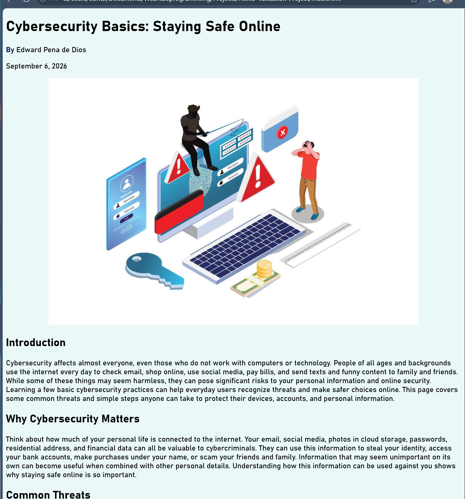

# Cybersecurity Basics: Staying Safe Online

A simple HTML5 webpage that introduces basic cybersecurity concepts and ways everyday internet users can protect themselves online.

## Live Demo

[View the live website](https://edwardpdd.github.io/Html5-Validation-Project/)

This project started as an assignment for my COP2830 Web Programming course. After completing the assignment, I went back and cleaned up the HTML structure and documentation to make the project suitable for my GitHub portfolio.

## About the Project

The original goal was to build a webpage by hand using HTML5 and make sure the final markup passed W3C validation.

I chose cybersecurity as the topic because it connects with my IT and cybersecurity studies. I also wrote the content myself with a specific audience in mind: people who use technology every day but may not have a technical background.

Instead of filling the page with technical terminology, I focused on situations that are easier for everyday users to recognize, such as suspicious package-delivery messages, password-reset scams, reused passwords, fake links, and requests for personal information. My goal was to explain why cybersecurity matters in a way that is practical and easy to understand.

## What I Used

- HTML5
- Basic inline CSS
- Git and GitHub
- W3C Markup Validation Service

## HTML Features

The page includes:

- Semantic elements such as `<header>`, `<main>`, `<section>`, `<figure>`, and `<footer>`
- External hyperlinks to cybersecurity resources
- A `mailto:` contact link
- An image with descriptive alternative text
- Page metadata and UTF-8 character encoding
- Basic background and text styling
- `target="_blank"` and `rel="noopener noreferrer"` for external links

## Validation

I tested the final `index.html` file with the W3C Markup Validation Service. The final version passed with zero HTML errors.

## Project Screenshot



## What I Learned

This project gave me more practice writing HTML from scratch instead of relying on a website builder or framework. One of the main things I learned was that a page displaying correctly in a browser does not necessarily mean the HTML is structured correctly.

After completing the original assignment, I refactored the page to use more meaningful semantic elements and separated larger blocks of text into proper paragraphs. Using the W3C validator helped me catch markup issues and verify the final version.

Writing the cybersecurity content was also an important part of the project. It gave me practice taking concepts I have learned in my cybersecurity studies and explaining them in a way that someone without a technical background could understand and use.

I also used Git throughout the project to track the original assignment and the changes I made afterward for the portfolio version.

## Project Structure

```text
Html5-Validation-Project/
├── index.html
├── README.md
└── screenshots/
    └── Webpage-preview.png
```

## Author

Edward Pena de Dios